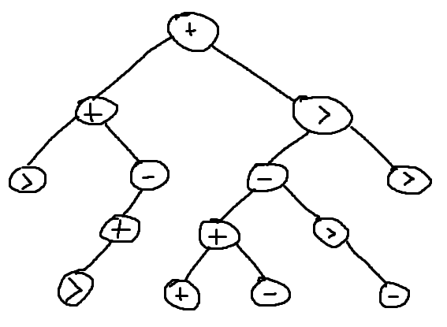

# 쒸프트키까안빠쪄요 - Solution

## 문제 분석
* ⚠️ 이 문제의 난이도는 Solved.ac 기준 $\color{rgb(0, 180, 252)}{\texttt{Diamond II}}$ ~ $\color{rgb(255, 0, 98)}{\texttt{Ruby V}}$ 로, 풀이에 Splay Tree 등 고난도 자료구조가 사용됩니다.

1. 문제의 시간 제한과 메모리 제한, 입력 제한을 확인하자.

    $N \leq 300,000$과 $Q \leq 100,000$을 만족하고, 시간 제한이 3초이므로 문제에서 요구하는 시간 복잡도는 $O(QN)$ 보다 작다는 사실을 확인할 수 있다.

2. 입력으로 주어지는 쿼리를 확인하자.

    > * ```1 L R K```: $A$의 부분 문자열 $A_{L, R} = A_L, A_{L+1}, ..., A_{R-1}, A_R$ 에 대해, $A_{L, R}$ 을 오른쪽으로 $K$만큼 시프트한다.
    > 
    > 즉, $0 < K < R-L$일 때 $A$는 다음과 같이 변화한다.
    > 
    > $A_1, ..., A_{L-1}, A_{R-K+1}, ..., A_R, A_L, A_{L+1}, ..., A_{R-K}, A_{R+1}, ..., A_N$
    > 
    > 만약 $K < 0$이라면, $A_{L, R}$을 왼쪽으로 $|K|$만큼 시프트한다.

    > * ```2 L R```: $A$의 부분 문자열 $A_{L, R} = A_L, A_{L+1}, ..., A_{R-1}, A_R$ 에 대해, $A_{L, R}$ 을 하나의 Brainf\*\*k 프로그램으로 간주하고 실행한다.
    >
    > 실행 후 Brainf\*\*k 프로그램의 포인터가 가리키고 있는 값의 인덱스를 X라 할 때, 프로그램의 배열의 각 주소에 저장된 값으로 새로운 수열 $B = B_1, B_2, ..., B_X$ 를 만든다.
    > 
    > 이후 B의 각 원소 중 최댓값을 출력한다.

    1번 쿼리는 문자열을 업데이트하고, 2번 쿼리는 문자열로 특정 연산을 시행해서 출력하는 쿼리이다.

    이때, 1번 쿼리가 요구하는 업데이트가 부분 문자열에 대한 시프트 연산이므로, 구간에 대한 뒤집기 쿼리를 쉽게 수행할 수 있는 자료구조가 필요함을 알 수 있다.

    또한, 2번 쿼리를 Naive하게 실행하면 $O(N)$ 의 시간 복잡도가 요구되므로, 적절한 자료구조를 사용해 2번 쿼리의 시간복잡도를 줄이는 것이 핵심이다.

따라서, 이 풀이에서는 구간에 대한 뒤집기 쿼리를 쉽게 수행할 수 있는 자료구조인 Splay Tree를 사용해 2번 쿼리를 효과적으로 처리하는 방법을 이용한다.

## 접근 - 2번 쿼리
2번 쿼리의 내용을 자세히 읽어 보면 다음과 같다.
1. A의 부분 문자열 $A_{L, R}$ 을 Brainf**k 프로그램으로 간주하고, 실행한다.
2. 프로그램이 실행된 후 프로그램의 포인터가 가리키는 인덱스를 X로 둔다.
3. 프로그램의 메모리에 저장된 값으로 수열 $B$를 만든다.
4. $\max_{i=1}^{X}$ $B_{i}$ 을 출력한다.

우선 문제에서 포인터의 값을 변화시키는 명령어가 `>`밖에 없음을 생각하자. 이는 다시 말해 포인터의 값이 프로그램을 실행하면서 항상 단조증가한다는 것을 의미한다.

또한, 나머지 두 명령어는 포인터가 현재 가리키는 주소의 값을 변화시키므로, 프로그램이 실행된 후 만들어지는 수열 B는 다음과 같이 정의할 수 있다.

1. $i=1$, $n=1$로 둔다.
2. $i \in \mathbb{N}$ 에 대해, $B_i=0$이다.
3. $A_{L, R}$ 에서의 $n$번째 명령어 $A_{L+n-1}$ 에 따라, 다음을 실행한다.
    * $A_{L+n-1} =$ `+` 라면, $B_i$ 의 값에 1을 더한다.
    * $A_{L+n-1} =$ `-` 라면, $B_i$ 의 값에서 1을 뺀다.
    * $A_{L+n-1} =$ `>` 라면, $i$를 1 증가시킨다.

$$
    A_{L, R} = +++-->+--->>--+-+>
$$

<p align="center"> ↓ </p>

$$
    B = [1, -2, 0, -1, 0]
$$

다만, 2번 쿼리가 주어질 때마다 위의 정의를 반복해 적용하는 것은 $O(N)$ 의 시간 복잡도를 가지므로, 이를 효과적으로 해결하기 위해서는 $A_{L, R}$에서의 값을 효율적으로 관리해야 한다.

### Splay Tree
Splay Tree의 각 노드가 $i \in [1, N]$인 $A_i$에 따라 `+`, `-`, `>` 순서대로 1, -1, 0의 값을 갖는다고 하자.

여기서, 각각의 노드가 나타내는 구간은 두 자식 노드 중 왼쪽 자식의 구간, 자기 자신이 나타내는 구간, 오른쪽 자식이 나타내는 구간을 순서대로 연결한 구간으로 생각하자.

그렇다면 임의의 문자열 $A$는 Splay Tree를 전위 순회한 결과로 생각할 수 있고, 따라서 Splay Tree를 다음과 같이 구축할 수 있다.

$$
    A = >+>+-+++-->->>
$$

<p align="center"> ↓ </p>

<p align="center">
    
</p>

각 노드의 값이 두 자식 노드가 가진 값의 합이라고 정의하면, A에 `>`가 포함되지 않았을 때 2번 쿼리의 답이 되며, 각 노드의 값은 `+`를 1, `-`를 -1로 치환했을 때 자신이 나타내는 구간의 구간합이 된다.

`>`에 해당하는 노드의 경우 구간의 합이 해당 노드를 기준으로 둘로 나누어지므로, 각 노드에 2번 쿼리의 답을 저장하기 위해서는 다음과 같은 방법을 적용한다.
1. 각 노드에 자신이 나타내는 구간에 해당하는 문자열을 실행했을 때 생성되는 수열 B에 대한 다음 값을 저장한다.
    * $B$의 첫 번째 원소 → $B_{L}$
    * $B$의 마지막 원소 → $B_{R}$
    * $B_1$, $B_X$가 아닌 B의 원소 중 최댓값 → $B_{MIDMAX}$
    * 생성되는 수열 $B$의 길이 → $len$
2. Splay Tree를 초기화 및 업데이트할 때, 다음을 수행한다.
    1. 초기화 시, 노드가 나타내는 값은 다음과 같다.
        * $B_{L}$ = $B_{R}$ = (노드별로 할당된 $A_i$에 따른 값)
        * $B_{MIDMAX}$ = $-\infty$
    2. 업데이트 시 노드의 왼쪽 자식과 자신의 값을 합친다.
        * 자식 노드가 나타내는 문자열의 길이에 따라 케이스를 분리해 업데이트한다.
            * 자식 노드의 $len$이 1일 경우, 자신의 $B_{L}$에 자식 노드의 값을 더해준다.
                * 자신의 $len$도 1일 경우, 자신의 $B_{R}$에도 자식 노드의 값을 더해준다.
            * 자식 노드의 $len$이 1이 아닐 경우, 다음을 수행한다.
                * 자신의 $B_{L}$은 자식 노드의 $B_{L}$이 된다.
                * 자신의 $B_{MIDMAX}$은 $\textrm{max}$ (자식 노드의 $B_{MIDMAX}$, 자식 노드의 $B_{R}$, 자신의 $B_{L}$, 자신의 $B_{MIDMAX}$)
                * 만약 자신의 $len$이 1일 경우
                    * 자신의 $B_{R}$은 (자식 노드의 $B_{R}$ + 자신의 $B_{R}$)이 된다.
                    * 자신의 $B_{MIDMAX}$은 자식 노드의 $B_{MIDMAX}$이 된다.
            * 자신의 $len$은 (자식 노드의 $len$ + 자신의 $len$ - 1)이 된다.
    3. 업데이트 시 2.를 수행한 후 자신의 값과 오른쪽 자식의 값을 합친다.
        * 왼쪽 자식과 자신의 값을 합치는 과정과 같은 방법으로 수행한다.
        * 단, 위 과정에서의 왼쪽 자식이 자신이 되고, 위 과정에서의 자신이 오른쪽 자식이 된다.
    * 자식 노드가 없을 경우, 업데이트를 할 필요가 없다.

이렇게 Splay Tree를 구축해 두면, 각 노드의 값을 계산하는 데 $O(1)$의 시간 복잡도에 계산할 수 있다.

따라서, 2번 쿼리의 답을 계산하는 데 $\textrm{Amortized}\space O(\textrm{log}\space N)$의 시간 복잡도가 요구된다.

## 접근 - 1번 쿼리
1번 쿼리는 $A$의 부분 문자열을 시프트하는 쿼리로, Splay Tree를 통해 효과적으로 처리할 수 있다.

우선, 구간 $[L, R]$에 해당하는 문자열을 $K$만큼 오른쪽으로 시프트하는 연산은 다음 3가지 과정으로 분리해 생각할 수 있다.
1. $A_{R-K+1, R}$을 뒤집는다.
2. $A_{L, R-K}$을 뒤집는다.
3. $A_{L, R}$을 뒤집는다.

이 과정을 $N=10$, $K=3$ 일 때의 예시로 나타내면 다음과 같다.

$$
    [1, 2, 3, 4, 5, 6, 7, \color{red}{8, 9, 10}\color{white}]
$$

<p align="center"> ↓ </p>

$$
    [\color{green}1, 2, 3, 4, 5, 6, 7\color{white}, \color{red}10, 9, 8\color{white}]
$$

<p align="center"> ↓ </p>

$$
    [\color{green}7, 6, 5, 4, 3, 2, 1\color{blue}, 10, 9, 8\color{white}]
$$

<p align="center"> ↓ </p>

$$
    [\color{blue}8, 9, 10, 1, 2, 3, 4, 5, 6, 7\color{white}]
$$

또한, Splay Tree에서 구간을 뒤집는 연산은 다음과 같이 재귀적으로 나타낼 수 있다.
1. 구간에 해당하는 노드를 $P$라 할 때, $P$의 왼쪽 자식 $P_L$과 오른쪽 자식 $P_R$을 맞바꾼다.
2. $P_L$의 왼쪽 자식 $P_{L_L}$과 오른쪽 자식 $P_{L_R}$을 맞바꾼다.
3. $P_R$의 왼쪽 자식 $P_{R_L}$과 오른쪽 자식 $P_{R_R}$을 맞바꾼다.
4. $P_{L_L}$의 ...

그런데, 구간을 뒤집는 연산을 할 때마다 구간에 포함되는 모든 노드를 업데이트한다면 시간 복잡도는 $O(N)$이 된다.

따라서, 구간을 뒤집는 연산을 수행할 때는 Lazy Propagation을 통해 시간 복잡도를 $O(\log N)$으로 줄여야 한다.

이 말은, 구간을 뒤집을 때 문자열이 변경되면서 바뀐 노드의 값을 상수 시간에 계산할 수 있어야 함을 의미한다.

이는 앞서 2번 쿼리에서 Splay Tree에 쿼리의 답을 저장할 때 사용했던 방법으로 해결할 수 있다.
1. 각 노드에 구간이 뒤집어져 있음을 나타내는 Bool 변수 $lazy$를 추가한다.
    * $lazy$가 1이라면 해당하는 구간이 뒤집어져 있음을 나타낸다.
2. 1번 쿼리가 주어지면 구간에 해당하는 노드의 $lazy$를 반전(0 → 1, 1 → 0)한 후, 다음을 수행한다.
   1. 해당하는 노드의 $lazy$가 0이라면, 업데이트가 필요하지 않다.
   2. 뒤집기 연산을 수행할 구간에 해당하는 노드를 $P$라 할 때, $P$의 왼쪽 자식 $P_L$과 오른쪽 자식 $P_R$을 맞바꾼다.
   3. $P$의 값을 위의 2번 쿼리의 답을 계산하는 과정과 동일한 방법으로 업데이트한다.
   4. $P_L$과 $P_R$의 $lazy$를 반전한다.
   5. $P$의 $lazy$를 0으로 바꾼다.
3. 2번 쿼리가 주어졌을 때 해당하는 노드의 $lazy$가 1이라면, 위와 같이 업데이트를 한 뒤 값을 출력한다.

이 방법을 이용하면 Splay Tree의 값을 업데이트하는 데 $\textrm{Amortized}\space O(\textrm{log}\space N)$의 시간 복잡도가 요구된다.

## 결론
위의 1번, 2번 쿼리에 대한 접근을 종합하면 문제를 $O(Q \log N)$의 시간 복잡도에 해결하는 코드를 작성할 수 있다.

이 시간 복잡도는 시간 제한을 통과하기에 충분하다.